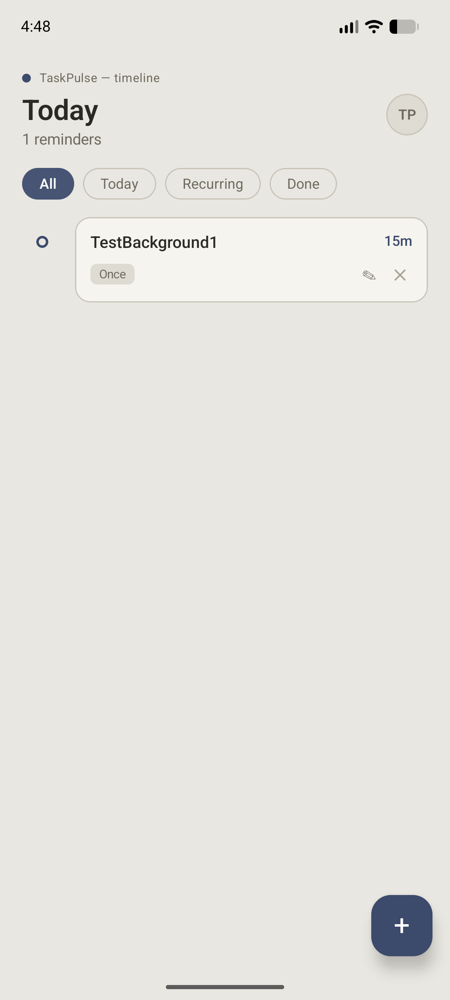
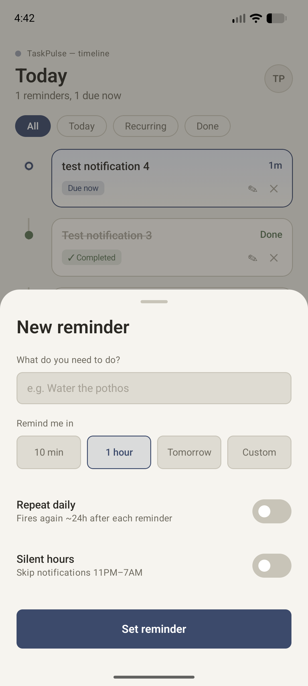
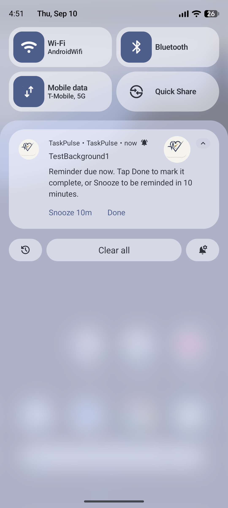

# TaskPulse

A modern, responsive Android task management app built with **Jetpack Compose**, **Room Database**, and **WorkManager**. TaskPulse allows users to schedule one-time or recurring daily reminders with interactive notification actions (*Done* & *Snooze*).

---

## 📱 Screenshots

| Task List & Filters | Add Task Screen | Notification Actions |
|:---:|:---:|:---:|
|  |  |  |

---

## ✨ Features

- **Task Creation & Scheduling**: Schedule one-time reminders with custom delays (minutes) or daily repeating reminders.
- **Interactive Notification Actions**:
  - **Done**: Marks task complete in Room DB via background worker and dismisses notification.
  - **Snooze**: Reschedules reminder for 10 minutes later and dismisses notification.
- **Completion & Filtering**: Toggle task completion with visual strikethrough and filter tasks by **All**, **Active**, and **Done**.
- **Offline First**: Room database with reactive Kotlin Flow updates.
- **Reliable Background Work**: Android WorkManager ensures scheduled notifications fire reliably across app restarts.

---

## 🛠️ Tech Stack

- **UI**: Jetpack Compose, Material 3
- **Architecture**: MVVM + Repository Pattern
- **Database**: Room (SQLite) with Kotlin Coroutines & Flow
- **Background Work**: WorkManager (`CoroutineWorker`, `OneTimeWorkRequest`, `PeriodicWorkRequest`)
- **Notifications**: NotificationCompat, BroadcastReceiver (`NotificationActionReceiver`)
- **Language**: Kotlin

---

## 🚀 Getting Started

### Prerequisites
- Android Studio Ladybug or newer
- Android SDK 29+ (Target SDK 36)
- JDK 11+
- Android device or emulator running Android 10+ (API 29+)

### Option 1: Run via Android Studio (Recommended)
1. Open **Android Studio**.
2. Select **Open** and choose the `TaskPulse` project root folder.
3. Wait for Gradle sync to complete.
4. Select your connected device or emulator in the toolbar dropdown.
5. Click the green **Run** button (▶️) or press `Shift + F10`.

### Option 2: Run via Terminal / CLI
```bash
# Clone the repository
git clone https://github.com/your-username/TaskPulse.git
cd TaskPulse

# Build debug APK
./gradlew assembleDebug

# Install and run on connected device/emulator
./gradlew installDebug

# Run unit tests
./gradlew testDebugUnitTest
```
