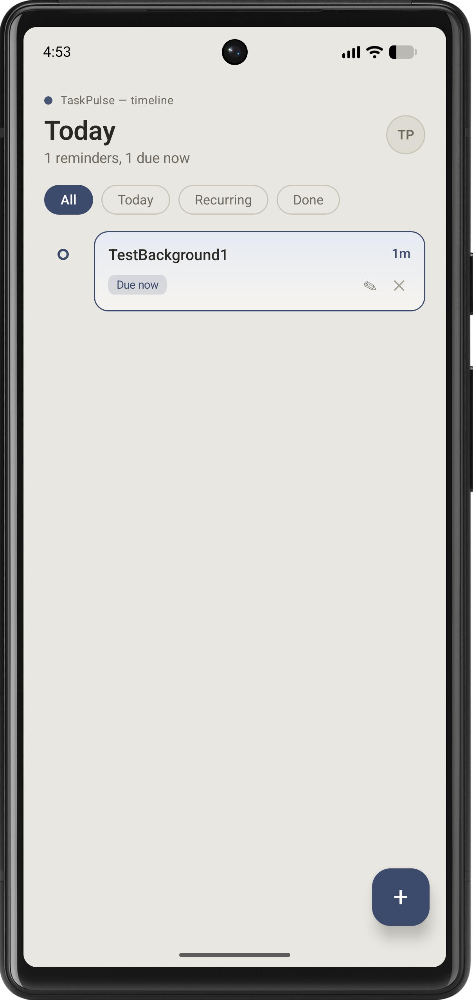
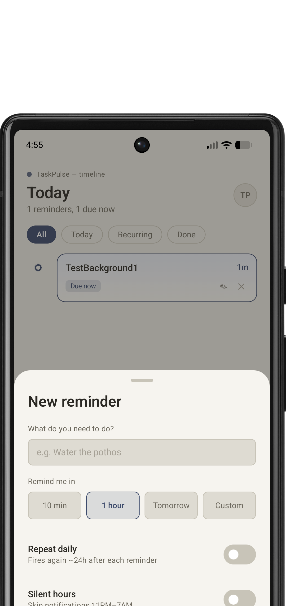
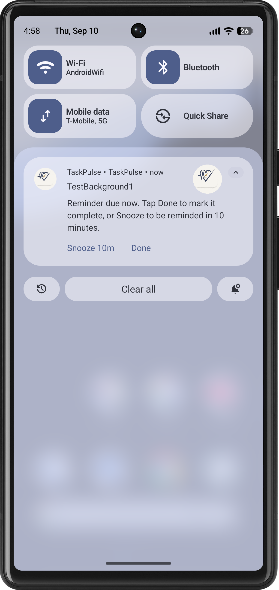

# TaskPulse

TaskPulse is a clean, simple, and reliable reminder app for Android. Built with modern Android tools (**Jetpack Compose**, **Room Database**, **AlarmManager**, and **WorkManager**), it helps you track your daily to-dos with a visual timeline, on-time alerts, and quick actions right from your notifications.

---

## 📱 Screenshots

| Timeline & Filters | Add / Edit Reminder | Interactive Notifications |
| :---: | :---: | :---: |
|  |  |  |

---

## ✨ Features

### 📅 Visual Day Timeline
- **Connected Timeline**: See your tasks lined up along a clean vertical line.
- **Color-Coded Status Dots**:
  - 🟢 **Green** for completed tasks
  - 🟡 **Warm Gold** for daily repeating tasks
  - 🔵 **Navy Blue** for active tasks
- **Quick Filters**: Switch easily between **All**, **Today**, **Recurring**, and **Done** tasks.

### ⏰ Easy Task Creation & Quick Editing
- **Quick Time Buttons**: Pick common reminder times in one tap (**10 min**, **1 hour**, **Tomorrow**), or type your own custom minutes.
- **Edit Anytime**: Tap any task card or its pencil icon to change its title or reminder time.
- **Repeat Daily**: Turn on the daily repeat switch for routines you do every day.
- **Silent Hours**: Option to silence reminders between 11 PM and 7 AM.

### 🔔 Reliable Notifications (Even When the App is Closed)
- **Exact Timing**: Short reminders (like 1 minute or 10 minutes) ring right on time, even if the app is completely closed or the phone is in sleep mode.
- **Survives Phone Restarts**: If you restart your phone, TaskPulse automatically restores your active reminders.
- **Custom App Icon**: Clean TaskPulse heartbeat emblem appears in the app launcher and on notifications.

### ⚡ Quick Actions from Notifications
- **Done**: Finish a task straight from the notification without opening the app.
- **Snooze (10m)**: Need a few more minutes? Tap snooze to be reminded again in 10 minutes.

### 👆 Smooth Gestures
- **Swipe to Delete**: Swipe a task card to the left to delete it and remove its scheduled reminder.
- **Tap to Mark Done**: Tap the status dot on any task card to mark it finished.

---

## 🎨 Design Colors (Paper & Ink)

TaskPulse uses a warm, paper-inspired look that is easy on the eyes:

| Color | Name | Used For |
| :--- | :--- | :--- |
| `#E9E7E1` | **Fog** | App background |
| `#F6F4EF` | **Paper** | Task cards and dialogs |
| `#2B2924` | **Ink** | Main dark text |
| `#6E6A5F` | **Graphite** | Secondary text and labels |
| `#3C4A6B` | **Indigo** | Main buttons and active reminders |
| `#5B7355` | **Moss** | Done and completed tasks |
| `#A87B2E` | **Ochre** | Daily recurring tasks |

---

## 🛠️ Built With

- **UI**: Jetpack Compose & Material 3
- **Database**: Room Database (stores your tasks locally on your device)
- **Exact Alarms**: Android `AlarmManager` (wakes device up for precise reminders)
- **Background Jobs**: AndroidX `WorkManager` (manages daily recurring tasks)
- **Notifications**: Android `NotificationCompat` with quick action buttons

---

## 🚀 How to Run the App

### Using Android Studio
1. Open **Android Studio**.
2. Click **File > Open** and select the `TaskPulse` folder.
3. Wait for Gradle sync to complete.
4. Pick your connected Android device or emulator (Android 10+ recommended).
5. Click the green **Run** button (▶️).

### Using the Terminal
```bash
# Build the app
./gradlew assembleDebug

# Install it on your connected device or emulator
./gradlew installDebug

# Run unit tests
./gradlew testDebugUnitTest
```
